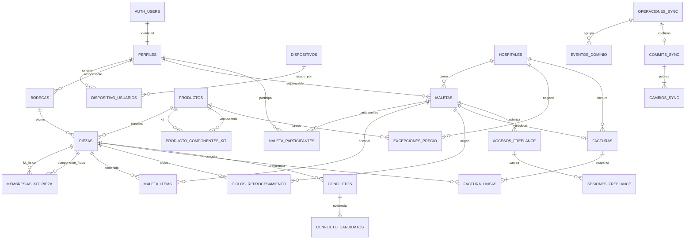

# Arquitectura de base de datos

## Alcance

PostgreSQL/Supabase es la fuente central autoritativa. IndexedDB/Dexie no se
elimina: conserva la réplica operativa, eventos, operaciones pendientes, inbox
y sesión habilitada para continuar trabajando sin red. La UI consume servicios
de `packages/data`; no distribuye consultas SQL ni claves privilegiadas.

## Decisiones principales

- Todas las entidades creadas offline usan UUID; no existen IDs
  autoincrementales de dispositivo.
- El catálogo (`productos`) y las unidades físicas (`piezas`) están separados.
- El dinero se guarda como `bigint` de cent; nunca como `float`.
- `piezas` y `maletas` son estados materializados; `eventos_dominio` conserva
  la historia inmutable.
- `maleta_items`, `membresias_kit_pieza` y `ciclos_reprocesamiento` son
  historiales temporales explícitos. El historial no se deduce desde una FK actual.
- `factura_lineas` guarda snapshots de código, SKU, nombre, cantidad, precio,
  tipo, subtotal y explicación. Una factura emitida es inmutable.
- `operaciones_sync` deduplica la entrega at-least-once por UUID y hash;
  `commits_sync`/`cambios_sync` proporcionan el cursor global.
- Los conflictos físicos nunca usan last-write-wins: la pieza pasa a
  `EN_CONFLICTO` y se conservan todos los candidatos.
- Los registros demo llevan `origen` y `lote_semilla_id`; la auditoría del
  handoff vive en el esquema privado y sobrevive a la purga.
- Dexie v8 conserva `credencialesOffline` y `auditoriaAcceso`. La primera solo
  guarda el derivado PBKDF2 del PIN y su autorización temporal por dispositivo;
  la segunda explica cada decisión local de acceso sin sustituir la auditoría
  central.

## Invariantes relevantes

- SKU y código físico son únicos sin distinguir mayúsculas (`citext`).
- Una pieza solo puede tener un `maleta_item` activo.
- Una pieza solo puede tener un ciclo de reprocesamiento abierto.
- Una pieza en estado de maleta debe referenciar una maleta actual;
  los estados incompatibles no pueden conservar esa referencia.
- Una factura por maleta; número fiscal único cuando se asigna.
- Una excepción referencia producto y hospital reales y registra propuesta y
  decisión por separado.
- Evento, operación y secuencia de dispositivo no pueden reutilizarse con otro
  contenido.
- La historia y las facturas emitidas están protegidas por triggers de
  inmutabilidad, además de no conceder DML directo al navegador.

## ERD

## Límites de seguridad

`public` está expuesto a PostgREST, pero cada tabla tiene RLS habilitado y
forzado. El rol real se consulta en `perfiles`; nunca se confía en
`raw_user_meta_data`. El navegador posee únicamente la clave publishable. Las
RPC con `service_role` solo son invocadas por Edge Functions o scripts de
operador. El esquema `private` contiene helpers, cabeza del cursor, desafíos y
auditoría administrativa.

Supabase Auth y `perfiles.activo` siguen siendo la autoridad de identidad. El
PIN offline no es una segunda cuenta central, no se envía al servidor y solo
desbloquea una réplica enrolada durante siete días. La reconexión valida el
token con Auth y consulta el perfil protegido por RLS antes de renovar. Una
revocación recibida por sync invalida también cualquier sesión offline abierta.
El UUID es una identidad lógica, no un secreto ni una prueba de hardware. La
amenaza de copia completa de los datos del navegador se mitiga fuera de la PWA
con dispositivos administrados, perfiles de sistema separados y cifrado de
disco; borrar datos del sitio elimina también el enrolamiento.

Las migraciones ordenadas están en `supabase/migrations`. Sus timestamps
coinciden con el historial remoto para que CLI y MCP no diverjan.

## Fronteras de escritura

- El trabajo físico offline se registra primero en Dexie y converge mediante
  la Edge Function `sync`; PostgreSQL valida estados, versiones, HLC e
  idempotencia dentro de funciones transaccionales.
- Las altas administrativas que requieren conexión pasan por
  `administration`: usuarios/Auth, hospitales, catálogo, piezas, precios y
  accesos freelance. La UI no posee permisos DML directos para saltarse esas
  reglas.
- `freelance-access` autentica tokens/sesiones efímeras y limita cada operación
  y cada cambio descargado a una sola maleta.
- `prepare-production` es la única entrada al desafío y saga de handoff. Al
  activar producción se crea también la bodega central productiva en la misma
  transacción, de modo que la primera alta real tenga un destino válido.
